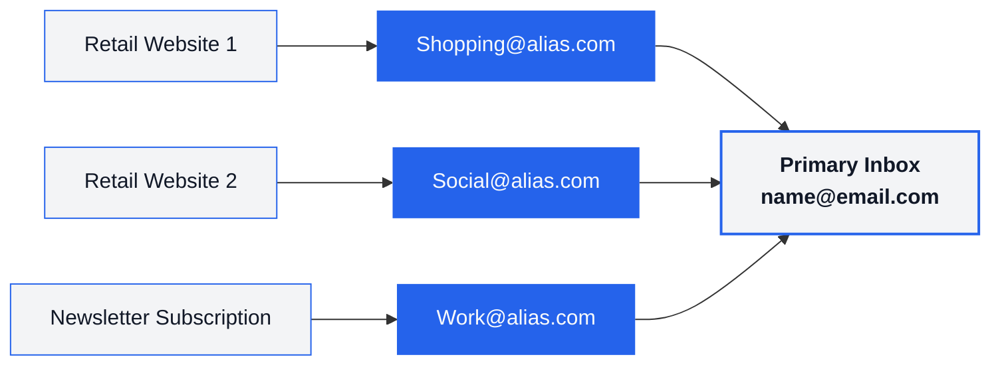

<div class="intro" align="center">

<picture>
  <source media="(prefers-color-scheme: light)" srcset="./public/logo/logo_dark.svg">
  <source media="(prefers-color-scheme: dark)" srcset="./public/logo/logo_light.svg">
  
</picture>

# Email Aliasing Comparison

[](https://github.com/fynks/email-aliasing-comparison)
[](https://github.com/fynks/email-aliasing-comparison/commits)
[](https://opensource.org/licenses/MIT)

**Compare 10+ email alias services by features, pricing, security, and privacy**

[Quick Start](#provider-selector) • [Comparisons](#provider-comparisons) • [Privacy & Security](#privacy-and-security-analysis) • [Best Practices](#best-practices) • [FAQ](#frequently-asked-questions)


</div>

## Table of Contents

<details>
<summary>Click to expand full table of contents</summary>

### Getting Started
- [What is Email Aliasing?](#what-is-email-aliasing)
- [Key Benefits](#key-benefits)
- [How it Works](#how-email-aliasing-works)
- [Types of Email Aliasing](#types-of-email-aliasing)
- [Provider Selector](#provider-selector)
- [Top 3 Recommendations](#top-3-recommendations)

### Provider Comparisons
- [Quick Reference Table](#quick-reference-table)
- [Free Plans Comparison](#free-plans-detailed-comparison)
- [Paid Plans Comparison](#paid-plans-detailed-comparison)
- [Addy.io vs SimpleLogin](#addy-io-vs-simplelogin)

### Privacy & Security
- [Data Collection & Retention](#data-collection-and-retention)
- [Legal & Compliance](#legal-and-compliance)
- [Cancellation & Downgrade Policies](#cancellation--downgrade-behavior)

### Best Practices
- [Alias Naming Conventions](#alias-naming-conventions)
- [Organization Strategies](#organization-strategies)
- [Common Mistakes to Avoid](#mistakes-to-avoid)

### Reference & Help
- [Feature Glossary](#feature-glossary)
- [Troubleshooting Guide](#troubleshooting-guide)
- [FAQ](#frequently-asked-questions)
- [Additional Resources](#additional-resources)
- [Contributing](#contributing)

</details>

## What is Email Aliasing?

Email aliasing lets you create alternate addresses that forward to your real inbox, so you can use unique addresses without exposing your primary email.

**Example:**
- Real inbox: `john.doe@gmail.com`
- Aliases: `shopping@provider.com`, `news@provider.com`
- Both forward to Gmail (many services also support replying from the alias)

## Key Benefits

- **Privacy**: Hide your real email to reduce breach exposure
- **Spam control**: Disable compromised aliases instantly
- **Organization**: Sort by alias/source
- **Tracking**: Identify who leaked or sold your data
- **Security**: Use unique addresses per service

## How Email Aliasing Works

Think of it like a P.O. Box for your email: you hand out a forwarding address instead of your real one.




## Types of Email Aliasing

#### Built‑in aliases:
  - Gmail "+" addressing (`yourname+tag@gmail.com`)
  - Outlook additional addresses/aliases
- **Pros:** Free and instant
- **Cons:** Limited management, easier to guess/strip

#### Dedicated services:
  - Full alias lifecycle management, custom domains, reply support, encryption, rules, APIs, dashboards

---

## Provider Selector

Choose the best provider based on your needs:

| Your Need | Best Choice | Price | Why |
|-----------|-------------|------:|-----|
| **Just starting** | DuckDuckGo Email Protection | Free | Zero setup, great tracker removal |
| **Budget conscious** | Addy.io Lite | $1/mo | Strong feature/price ratio |
| **Maximum privacy** | SimpleLogin (by Proton) | $4/mo | Swiss jurisdiction, strong security, apps |
| **Apple ecosystem** | Hide My Email (iCloud+) | from $0.99/mo | System-level integration, easy replies |
| **Developers/self-hosting** | Forward Email | from $3/mo | Open-source, own domain, flexible |

> [!NOTE]
> Prices shown are starting paid tiers. Many providers offer free plans.
> iCloud+ pricing varies by storage tier and region.

[(↑ Back to top)](#table-of-contents)

<br>

## Top 3 Recommendations

| Best for Beginners | Best Value | Most Secure |
|--------------------|------------|-------------|
| **[DuckDuckGo Email](https://duckduckgo.com/email)**<br><br>**Price:** Free<br>**Aliases:** Unlimited `@duck.com`<br>**Setup:** Zero config<br><br>**Pros:**<br>- Easy onboarding<br>- Tracker removal<br>- Reply support<br><br>**Cons:**<br>- `@duck.com` only | **[Addy.io](https://addy.io)**<br><br>**Price:** $1/mo (Lite)<br>**Aliases:** Unlimited<br>**Domains:** 1 custom<br><br>**Pros:**<br>- GPG/OpenPGP, API<br>- Rules, webhooks<br>- Reply support<br><br>**Cons:**<br>- Solo developer | **[SimpleLogin](https://simplelogin.io)**<br><br>**Price:** $4/mo<br>**Aliases:** Unlimited<br>**Jurisdiction:** Switzerland<br><br>**Pros:**<br>- PGP, WebAuthn<br>- Proton integration<br>- Mature apps<br><br>**Cons:**<br>- Higher cost |

[(↑ Back to top)](#table-of-contents)

---

# Provider Comparisons


### Quick Reference Table


| Provider | Jurisdiction | Free Tier | Starting Price | Reply Support | Open Source | Encryption |
|----------|:------------:|-----------|---------------:|:-------------:|:-----------:|:----------:|
| [Addy.io](https://addy.io) | Netherlands | ✅ | $1/mo | Paid plans | Partial | TLS |
| [SimpleLogin](https://simplelogin.io) | Switzerland | ✅ (10 aliases) | $4/mo | ✅ | ✅ | TLS |
| [Forward Email](https://forwardemail.net) | USA | ✅ (own domain) | $3/mo | ✅ | ✅ | TLS |
| [DuckDuckGo Email](https://duckduckgo.com/email) | USA | ✅ (unlimited) | Free only | ✅ | Partial | TLS |
| [Firefox Relay](https://relay.firefox.com) | USA | ✅ (5 aliases) | $0.99-$1.99/mo | Premium | Partial | TLS |
| [AdGuard Mail](https://adguard.com/adguard-temp-mail) | Cyprus | ✅ (limited) | $2.99/mo | Premium | Partial | TLS |
| [33Mail](https://33mail.com) | UK | ✅ | $1/mo | Premium | ❌ | TLS |
| [IronVest](https://ironvest.com) | USA | ❌ | $39/yr | ✅ | ❌ | TLS |
| [Erine.email](https://erine.email) | France | ✅ | Free | ✅ | ✅ | TLS |
| [Apple Hide My Email](https://support.apple.com/en-us/HT210425) | USA | Requires iCloud+ | from $0.99/mo | ✅ | ❌ | TLS |

[(↑ Back to top)](#table-of-contents)

<br>

## Free Plans Detailed Comparison

| Provider | Free Aliases | Reply Support | Custom Domains | Monthly Limits | Standout Features | Best For |
|----------|--------------|:-------------:|:--------------:|----------------|-------------------|----------|
| Addy.io | Unlimited standard + limited shared domain | ❌ | ❌ | ~10 MB bandwidth | GPG/OpenPGP, API (paid) | Power users trial |
| SimpleLogin | 10 | ✅ | ❌ | Fair use | PGP, mobile apps, browser extensions | Beginners |
| DuckDuckGo | Unlimited @duck.com | ✅ | ❌ | Fair use | Tracker removal, autofill | Quick start |
| Firefox Relay | 5 | ❌ | ❌ | Fair use | Tracker removal, Firefox integration | Mozilla users |
| AdGuard Mail | ~10 | ❌ | ❌ | ~2,000 emails | Temporary aliases, ecosystem | Light usage |
| 33Mail | Unlimited | ❌ | ❌ | ~10 MB | Simple and reliable | Basic forwarding |
| Erine.email | Unlimited | ✅ | ❌ | Fair use | Open-source, EU-hosted | Privacy advocates |
| Forward Email | Unlimited* | ✅ | ✅ (own domain) | Provider SMTP limits | Open-source, self-host option | Developers |
| Apple Hide My Email | N/A (iCloud+ required) | ✅ | Separate feature | Apple policy | Seamless Apple integration | Apple users |


> [!NOTE]
> *Own domain required for Forward Email free tier.

[(↑ Back to top)](#table-of-contents)

<br>

## Paid Plans Detailed Comparison

| Provider & Plan | Price | Aliases | Reply | Domains | Key Features | Target |
|---|---:|---:|:---:|---:|---|---|
| Addy.io Lite | $1/mo | Unlimited + 50 shared | ✅ | 1 | GPG/PGP, API, basic rules | Individual |
| Addy.io Pro | $3/mo (yr) / $4/mo | Unlimited | ✅ | 20 | Analytics, rules, bulk ops, webhooks | Power users |
| SimpleLogin Premium | $4/mo | Unlimited | ✅ | Unlimited | PGP, Proton integration, directory patterns | Individuals/Teams |
| AdGuard Mail Premium | $2.99/mo | ~1,000 | ✅ | 1 | Anonymous replies, premium domains | Corporate/Power users |
| 33Mail Premium | $1/mo | Unlimited | ✅ (20/day) | 5 | Simple interface, longevity | Small business |
| 33Mail Pro | $5/mo | Unlimited | ✅ (up to 1000/day) | Unlimited | Higher volume | Business |
| IronVest Premium | $39/yr | ~50 | ✅ | ❌ | Virtual cards, phone masking | All‑in‑one privacy |
| Forward Email Enhanced | $3/mo | Unlimited | ✅ | Unlimited | 100% open‑source stack, webhooks | Developers |
| Apple iCloud+ 50GB | from $0.99/mo | Up to 1,000 | ✅ | ✅ (iCloud Mail custom domains) | System‑level integration | Apple users |

> [!NOTE]
> - Regional pricing varies.
> - “Unlimited” often means “no fixed hard cap” but subject to fair use/abuse limits.

[(↑ Back to top)](#table-of-contents)

---

## Addy.io vs SimpleLogin

| Criteria | Addy.io | SimpleLogin | Winner |
|----------|---------|-------------|--------|
| **Best for Beginners** | Moderate setup complexity | Simple setup and interface | SimpleLogin |
| **Best for Power Users** | Advanced features, better value | Core features focus | Addy.io |
| **Best Value** | $1/mo for most features | $4/mo for all features | Addy.io |
| **Most Reliable** | Single developer dependency | Enterprise infrastructure | SimpleLogin |
| **Best Privacy** | Netherlands jurisdiction, GPG | Switzerland jurisdiction, PGP | Tie |

<details>
<summary><strong>Detailed Feature & Company Analysis</strong> (click to expand)</summary>

### Company Structure Analysis

**Addy.io: The Independent Pioneer**
- **Strengths:** Quick updates, direct communication, lower costs, innovation
- **Concerns:** Single point of failure, limited capacity, no succession plan

**SimpleLogin: The Enterprise Solution**
- **Strengths:** Team redundancy, 24/7 support, financial stability, professional operations
- **Concerns:** Corporate bureaucracy, higher costs, less experimental

### Core Features Comparison

| Feature | Addy.io | SimpleLogin |
|---------|---------|-------------|
| **Bulk Operations** | CSV import/export | Basic bulk |
| **Search & Filter** | Advanced | Basic |
| **Bounce Handling** | Detailed logs | Basic |
| **Spam Detection** | SpamAssassin | Basic |

### Advanced Features Comparison

| Feature | Addy.io | SimpleLogin |
|---------|---------|-------------|
| **Conditional Rules** | Advanced regex | Basic patterns |
| **Auto-Enable/Disable** | Smart rules | Manual only |
| **Usage Analytics** | Detailed charts | Basic counts |
| **Bandwidth Tracking** | Per-alias | Not available |
| **Alert System** | Configurable | Basic notifications |

### Security Comparison

| Feature | Addy.io | SimpleLogin |
|---------|---------|-------------|
| **2FA Support** | TOTP only | TOTP + WebAuthn |
| **Password Security** | bcrypt | Argon2 |
| **Session Management** | Standard | Advanced |
| **Security Audits** | 2023 (Securitum) | Regular audits |

</details>

---

# Privacy and Security Analysis

## Data Collection and Retention

> [!IMPORTANT]
> Always prefer the provider’s current privacy policy; retention practices can change.

| Provider | Email Content Storage | IP Logging | Analytics | Account Data |
|---|---|---|---|---|
| Addy.io | Doesn’t persist delivered content; undelivered may queue | Short‑term for abuse/fraud | Self‑hosted analytics | Email; optional recipients (encrypted at rest) |
| SimpleLogin | Stores only what’s needed for delivery/queue; logs limited | Short‑term for abuse/fraud | Plausible (privacy‑focused) | Email, billing via processor |
| Forward Email | Delivery/queue only; self‑host options | Configurable/self‑host | None by default | Minimal (domain configs, DNS) |
| DuckDuckGo Email | Strips trackers; minimal logs | Minimization approach | Anonymous/aggregate | Email address only |
| Firefox Relay | Delivery only; Mozilla policies apply | Mozilla policies | Mozilla telemetry (privacy‑respecting) | Mozilla account data |
| AdGuard Mail | Delivery only | Anti‑abuse logs | Internal | Email and account |
| 33Mail | Delivery only | Standard logs | Unknown | Basic account |
| IronVest | Delivery only | Standard logs | Basic | Account & payment |
| Apple Hide My Email | Delivery only | Apple policy | Apple analytics | iCloud account data |

> [!TIP]
> For true content secrecy, use end‑to‑end encryption (PGP/GPG) with contacts. Aliasing alone does not hide content from providers.

[(↑ Back to top)](#table-of-contents)


## Cancellation / Downgrade Behavior

Understanding what happens when you downgrade helps you avoid vendor lock-in.

| Provider | Keeps Working | Disabled | Deleted | Risk |
|---|---|---|---|---|
| SimpleLogin | Existing aliases/domains; receive/reply within free limits | Creating new aliases beyond free | Nothing permanent | Minimal |
| Forward Email | Existing forwarding | Premium SMTP/API, priority support | Some premium configs | Low |
| AdGuard Mail | Free features, base alias quota | Premium domains/features | Premium‑only aliases | Low |
| 33Mail | Basic forwarding | Custom domains, higher reply limits | Custom domain configs | Moderate |
| Firefox Relay | First 5 aliases | Extra aliases, custom domains (if offered) | Aliases beyond free limit | Moderate |
| Addy.io | Standard aliases; 1 recipient; basic forwarding | Multiple recipients, usernames, custom/shared domains, reply | Extra recipients, premium domain aliases | Moderate |

> [!TIP]
> **Best practice**: Export alias → service mappings before you upgrade and before any downgrade.

[(↑ Back to top)](#table-of-contents)

---


# Legal and Compliance

Jurisdiction can affect data access rules, retention, and government requests.

| Provider | Jurisdiction | GDPR | Retention | Govt Requests |
|----------|--------------|:----:|-----------|---------------|
| SimpleLogin | Switzerland (Proton) | ✅ | Minimal; logs time-limited | Requires Swiss/EU legal process |
| Addy.io | Netherlands (EU) | ✅ | Minimal; deletion upon request | EU legal process |
| Erine.email | France (EU) | ✅ | Minimal collection | EU legal process |
| AdGuard Mail | Cyprus (EU) | ✅ | Standard EU retention | EU legal process |
| 33Mail | United Kingdom | ✅ (UK GDPR) | Standard | UK legal process |
| Forward Email | United States | ✅ (as applicable) | Configurable/self-host | US law; self-host option |
| DuckDuckGo | United States | ✅ (as applicable) | Minimal collection | US law; transparency statements |
| Firefox Relay | United States | ✅ (as applicable) | Mozilla policies | US law; transparency reports |
| Apple Hide My Email | United States | ✅ (as applicable) | Apple policies | US law; well-documented process |

> [!TIP]
> **Practical Picks by Privacy Level:**
> - **Maximum privacy:** Switzerland (SimpleLogin/Proton)
> - **Strong privacy + features:** EU providers (Addy.io, Erine.email)
> - **Acceptable with trade-offs:** US providers (DuckDuckGo, Forward Email, Apple)


[(↑ Back to top)](#table-of-contents)


---

## Addy.io vs SimpleLogin

| Criteria | Addy.io | SimpleLogin | Winner |
|----------|---------|-------------|--------|
| **Best for Beginners** | Moderate setup complexity | Simple setup and interface | SimpleLogin |
| **Best for Power Users** | Advanced features, better value | Core features focus | Addy.io |
| **Best Value** | $1/mo for most features | $4/mo for all features | Addy.io |
| **Most Reliable** | Single developer dependency | Enterprise infrastructure | SimpleLogin |
| **Best Privacy** | Netherlands jurisdiction, GPG | Switzerland jurisdiction, PGP | Tie |

### Company Structure Analysis

**Addy.io: The Independent Pioneer**
- **Strengths:** Quick updates, direct communication, lower costs, innovation
- **Concerns:** Single point of failure, limited capacity, no succession plan

**SimpleLogin: The Enterprise Solution**
- **Strengths:** Team redundancy, 24/7 support, financial stability, professional operations
- **Concerns:** Corporate bureaucracy, higher costs, less experimental
- **Mitigations:** Backed by Proton, a well-established privacy company

#### Feature Comparison Details

### Core Features Comparison

| Feature | Addy.io | SimpleLogin |
|---------|---------|-------------|
| **Bulk Operations** | CSV import/export | Basic bulk |
| **Search & Filter** | Advanced | Basic |
| **Bounce Handling** | Detailed logs | Basic |
| **Spam Detection** | SpamAssassin | Basic |

### Advanced Features Comparison

| Feature | Addy.io | SimpleLogin |
|---------|---------|-------------|
| **Conditional Rules** | Advanced regex | Basic patterns |
| **Auto-Enable/Disable** | Smart rules | Manual only |
| **Usage Analytics** | Detailed charts | Basic counts |
| **Bandwidth Tracking** | Per-alias | Not available |
| **Alert System** | Configurable | Basic notifications |

### Security Comparison

| Feature | Addy.io | SimpleLogin |
|---------|---------|-------------|
| **2FA Support** | TOTP only | TOTP + WebAuthn |
| **Password Security** | bcrypt | Argon2 |
| **Session Management** | Standard | Advanced |
| **Security Audits** | 2023 (Securitum) | Regular audits |

[(↑ Back to top)](#table-of-contents)

---


# Best Practices

## Alias Naming Conventions

### Recommended Formats

| Format | Example | Use Case |
|--------|---------|----------|
| `service-purpose@` | `amazon-shopping@provider.com` | Service-specific aliases |
| `category-date@` | `newsletter-2025@provider.com` | Time-based organization |
| `trustlevel-service@` | `trusted-banking@provider.com` | Security-based sorting |

### Avoid These Patterns

- **Random strings:** `abc123xyz@provider.com` (hard to track)
- **Generic names:** `general@provider.com` (defeats the purpose)
- **Same alias everywhere:** (no breach isolation)

## Organization Strategies

<details>
<summary><strong>View organization strategies</strong> (click to expand)</summary>

### By Category
- `shopping@provider.com` - All e-commerce
- `social@provider.com` - Social media platforms
- `work@provider.com` - Professional accounts
- `newsletter@provider.com` - Subscriptions

### By Trust Level
- `trusted@provider.com` - Banking, important services
- `testing@provider.com` - New services you're trying
- `disposable@provider.com` - One-time signups

### By Time Period
- `monthly-2025-01@provider.com` - Rotate monthly
- `yearly-2025@provider.com` - Annual rotation

</details>
<br>

[(↑ Back to top)](#table-of-contents)

---

## Common Mistakes to Avoid

| Mistake | Wrong Approach | Right Approach |
|---------|----------------|----------------|
| **Random/reused aliases** | `abc123xyz@provider.com` or `general@provider.com` | `amazon-shopping@provider.com` (unique per service) |
| **Not testing replies** | Assuming replies will work | Always send a test from your alias before important use |
| **Skipping password manager** | Not tracking which alias goes where | Store alias + service mapping to avoid lockouts |
| **No backup plan** | Immediately switching all accounts | Keep original email active during transition; export aliases |
| **Rushing critical accounts** | Migrating banking/2FA accounts first | Start with low-risk accounts, then move to banking/work/2FA |

<br><br>
[(↑ Back to top)](#table-of-contents)

---

# Reference and Support

## Feature Glossary

**Core Concepts:**
- **Alias**: An email address that forwards to your real inbox
- **Catch-All**: Automatically forwards ALL emails to a domain
- **Reply Support**: Ability to send emails FROM your alias
- **Custom Domain**: Using your own domain for aliases

**Advanced Features:**
- **Directory/Subdomain**: Create aliases on-the-fly using patterns
- **Rules Engine**: Automatic actions based on email content
- **Bandwidth Limiting**: Restrict data transfer per alias
- **Webhook Support**: Real-time notifications to your applications

**Security Terms:**
- **GPG/PGP**: End-to-end encryption standards
- **Two-Factor Authentication (2FA)**: Extra login security
- **Zero-Knowledge**: Provider can't read your data

[(↑ Back to top)](#table-of-contents)

## Troubleshooting Guide

<details>
<summary><strong>Emails not forwarding</strong></summary>

1. Check spam/junk folder
2. Send a direct test to the alias
3. If using custom domain: wait 24-48h for DNS propagation
4. Check your email client filters/rules

</details>

<details>
<summary><strong>Can't reply from alias</strong></summary>

1. Confirm your plan supports replies
2. Configure SMTP/app settings from provider docs
3. Verify Reply-To settings in provider dashboard

</details>

<details>
<summary><strong>Slow delivery</strong></summary>

**Expected delivery times:**
- Normal: 5-30 seconds
- Peak hours: up to 2-5 minutes
- International: up to 10 minutes

**Action:** Check provider status page for incidents

</details>

## Frequently Asked Questions

<details>
<summary><strong>Will recipients know it's an alias?</strong></summary>

No. Recipients see the alias as the sender unless you disclose it.

</details>

<details>
<summary><strong>Can I reply from my alias?</strong></summary>

Most paid services support replies. Free tier support varies (DuckDuckGo and SimpleLogin free both support replies).

</details>

<details>
<summary><strong>What if the provider shuts down?</strong></summary>

Keep your main email active, document alias mappings, and maintain a migration plan. Consider having a backup provider for critical aliases.

</details>

<details>
<summary><strong>Are aliases safe for banking?</strong></summary>

Yes, but migrate critical accounts last and choose a reliable provider with good support and strong security track record.

</details>

<details>
<summary><strong>How many aliases do I need?</strong></summary>

Typically 10-50 aliases. Start with categories: shopping, social, newsletters, work, and disposable.

</details>

## Additional Resources
### Official Documentation
- [Addy.io Help Center](https://addy.io/help/)
- [SimpleLogin Documentation](https://simplelogin.io/docs/)
- [ForwardMail Documentation](https://forwardemail.net/en/docs)
- [DuckDuckGo Email Help](https://duckduckgo.com/duckduckgo-help-pages/email-protection/)
- [Firefox Relay Support](https://support.mozilla.org/en-US/products/relay)

### Privacy and Security Guides
- [Privacy Guides - Email Aliasing](https://www.privacyguides.org/en/email-aliasing/) - Independent privacy analysis
- [The New Oil - Email Aliasing Guide](https://thenewoil.org/en/guides/moderately-important/email-aliasing/) - Practical privacy education
- [Proton - What is Email Alias](https://proton.me/blog/what-is-email-alias) - Technical explanation from Proton

### Video Tutorials: 
- [The Ultimate Guide to Aliasing For Privacy & Security](https://www.youtube.com/watch?v=cgnsa5IMufs) by *Techlore*
- [ULTIMATE Email Privacy Guide (5 Ways to Use Aliases)](https://www.youtube.com/watch?v=buJHg7HRHPc) by *All Things Secured*
- [STOP Giving Your Real Email Address (do this instead)](https://www.youtube.com/watch?v=J7uGUD9kprs) by *All Things Secured*
- [Use an Email Alias!](https://www.youtube.com/watch?v=5HHdk_GP-Ew) by *Naomi Brockwell TV*

### Community Forums: 
  - [r/privacy](https://reddit.com/r/privacy) - General privacy discussions
  - [r/emailprivacy](https://www.reddit.com/r/emailprivacy) - Email privacy topics
  - [r/simpleLogin](https://www.reddit.com/r/SimpleLogin) - SimpleLogin subreddit
  - [r/addy_io](https://www.reddit.com/r/addy_io/) - Addy.io subreddit

[(↑ Back to top)](#table-of-contents)

---

## Contributing

Found an error or outdated info? Contributions keep this guide accurate.

**Verification Standards:**
- Use official docs/pricing pages/privacy policies
- Include links and verification dates in PRs/issues

**Quick Contributions:**
- Pricing/feature updates (with links/screenshots)
- New provider suggestions (include free/paid plans, security features, jurisdiction)

**Quality Standards:**
- Accuracy first with neutral tone
- Include dates for pricing/feature claims
- Keep tables and sections consistent

> For detailed guidelines see: [CONTRIBUTING.md](CONTRIBUTING.md)

[(↑ Back to top)](#table-of-contents)

---

## License

**MIT License** - see [LICENSE](LICENSE.md)

**What this means:**
- Free to use for personal or commercial purposes
- Modify and distribute with attribution
- No warranty; information provided as-is

**Attribution for substantial reuse:**

```
Source: Email Aliasing Comparison Guide
Author: github.com/fynks/email-aliasing-comparison
License: MIT
```

---

### Disclaimer
Always verify current pricing, limits, and policies from official provider sites before making decisions. The authors are not affiliated with any email aliasing providers.

---

<div align="center">

⚡ Made with ❤️ by [fynks](https://github.com/fynks)

</div>
