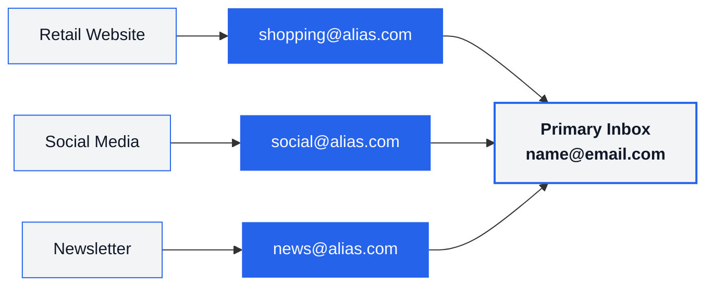

<div class="intro" align="center">

<picture>
  <source media="(prefers-color-scheme: light)" srcset="./public/logo/logo_dark.svg">
  <source media="(prefers-color-scheme: dark)" srcset="./public/logo/logo_light.svg">
  
</picture>

# Email Aliasing Comparison

[](https://github.com/fynks/email-aliasing-comparison)
[](https://github.com/fynks/email-aliasing-comparison/commits)
[](https://opensource.org/licenses/MIT)

**Compare 12+ email alias services by features, pricing, security, and privacy**

[Quick Start](#provider-selector)&nbsp; • &nbsp;[Comparisons](#provider-comparisons)&nbsp; • &nbsp;[Privacy & Security](#privacy-and-security-analysis)&nbsp; • &nbsp;[Best Practices](#best-practices)&nbsp; • &nbsp;[FAQ](#frequently-asked-questions)

</div>

---

## Table of Contents

<details>
<summary>Click to expand full table of contents</summary>

### Getting Started
- [What is Email Aliasing?](#what-is-email-aliasing)
- [Key Benefits](#key-benefits)
- [How it Works](#how-email-aliasing-works)
- [Types of Email Aliasing](#types-of-email-aliasing)
- [Provider Selector](#provider-selector)
- [Top Recommendations](#top-recommendations)

### Provider Comparisons
- [Quick Reference Table](#quick-reference-table)
- [Free Plans Comparison](#free-plans-detailed-comparison)
- [Paid Plans Comparison](#paid-plans-detailed-comparison)
- [Addy.io vs SimpleLogin](#addyio-vs-simplelogin)

### Privacy & Security
- [Data Collection & Retention](#data-collection-and-retention)
- [Legal & Compliance](#legal-and-compliance)
- [Cancellation & Downgrade Policies](#cancellation--downgrade-behavior)

### Best Practices
- [Alias Naming Conventions](#alias-naming-conventions)
- [Organization Strategies](#organization-strategies)
- [Common Mistakes to Avoid](#common-mistakes-to-avoid)

### Reference & Help
- [Feature Glossary](#feature-glossary)
- [Troubleshooting Guide](#troubleshooting-guide)
- [FAQ](#frequently-asked-questions)
- [Additional Resources](#additional-resources)
- [Contributing](#contributing)

</details>

---

<br>

## What is Email Aliasing?

Email aliasing lets you create alternate addresses that forward to your real inbox - so you can use unique addresses per service without exposing your primary email.

**Example:**
- Real inbox: `john.doe@gmail.com`
- Aliases: `shopping@provider.com`, `news@provider.com`
- Both forward to your real inbox (most services also support replying from the alias)

---

## Key Benefits

- **Privacy**: Hide your real email; reduce breach exposure
- **Spam control**: Instantly disable compromised aliases
- **Organization**: Sort and filter emails by alias or source
- **Tracking**: Identify who leaked or sold your data
- **Security**: Unique address per service = breach isolation

---

## How Email Aliasing Works

Think of it like a P.O. Box for your email - you hand out forwarding addresses, never your real one.



---

## Types of Email Aliasing

#### Built-in (Free, Limited)
- Gmail `+` addressing (`you+tag@gmail.com`)
- Outlook additional aliases
- **Pros:** Zero setup, free
- **Cons:** Easily stripped/guessed, no lifecycle management

#### Dedicated Services (Recommended)
- Full alias management, custom domains, reply support, encryption, rules, APIs, dashboards
- Examples: Addy.io, SimpleLogin, Forward Email, DuckDuckGo Email

---

## Provider Selector

| Your Need | Best Choice | Price | Why |
|-----------|-------------|------:|-----|
| **Just starting** | DuckDuckGo Email Protection | Free | Zero setup, tracker removal, unlimited aliases |
| **Budget conscious** | Addy.io Lite | $1/mo | Best feature-to-price ratio |
| **Maximum privacy** | SimpleLogin (by Proton) | $4/mo | Swiss jurisdiction, PGP, WebAuthn, mature apps |
| **Apple ecosystem** | Hide My Email (iCloud+) | from $0.99/mo | System-level iOS/macOS integration |
| **Developers / self-hosting** | Forward Email | from $3/mo | 100% open-source, unlimited domains |
| **All-in-one privacy** | Cloaked | ~$10/mo | Email + phone masking + password management |
| **Full email hosting + aliases** | StartMail | $5/mo | PGP, custom domains, full IMAP mailbox |

> [!NOTE]
> Prices are starting paid tiers. Many providers offer free plans. Regional pricing may vary.

[(↑ Back to top)](#table-of-contents)

---

## Top Recommendations

| Best for Beginners | Best Value | Most Secure |
|--------------------|------------|-------------|
| **[DuckDuckGo Email](https://duckduckgo.com/email)**<br><br>**Price:** Free<br>**Aliases:** Unlimited `@duck.com`<br>**Setup:** Zero config<br><br>✅ Easy onboarding<br>✅ Tracker removal<br>✅ Reply support<br><br>⚠️ `@duck.com` domain only<br>⚠️ No custom domains | **[Addy.io](https://addy.io)**<br><br>**Price:** $1/mo (Lite)<br>**Aliases:** Unlimited<br>**Domains:** 1 custom<br><br>✅ GPG/OpenPGP encryption<br>✅ API + webhooks<br>✅ Rules engine<br><br>⚠️ Solo developer<br>⚠️ 50 shared-domain alias limit on Lite | **[SimpleLogin](https://simplelogin.io)**<br><br>**Price:** $4/mo (includes Proton Pass Plus)<br>**Aliases:** Unlimited<br>**Jurisdiction:** Switzerland<br><br>✅ PGP + WebAuthn/TOTP<br>✅ Proton-backed infrastructure<br>✅ Mature apps & browser extensions<br><br>⚠️ Higher cost vs. Addy.io<br>⚠️ 10-alias limit on free plan |

[(↑ Back to top)](#table-of-contents)

---

# Provider Comparisons

## Quick Reference Table

| Provider | Jurisdiction | Free Tier | Starting Price | Reply Support | Open Source | Notable |
|----------|:------------:|:---------:|---------------:|:-------------:|:-----------:|---------|
| [Addy.io](https://addy.io) | Netherlands 🇳🇱 | ✅ | $1/mo | Paid only | ✅ | GPG, API, webhooks |
| [SimpleLogin](https://simplelogin.io) | Switzerland 🇨🇭 | ✅ (10 aliases) | $4/mo | ✅ | ✅ | Proton-owned, Pass Plus bundled |
| [Forward Email](https://forwardemail.net) | USA 🇺🇸 | ✅ (own domain) | $3/mo | ✅ | ✅ | AES-256 at rest, 10GB storage |
| [DuckDuckGo Email](https://duckduckgo.com/email) | USA 🇺🇸 | ✅ (unlimited) | Free only | ✅ | Partial | Tracker removal |
| [Firefox Relay](https://relay.firefox.com) | USA 🇺🇸 | ✅ (5 masks) | $0.99/mo | Premium | Partial | Phone masking on Premium |
| [AdGuard Mail](https://adguard.com/adguard-temp-mail) | Cyprus 🇨🇾 | ✅ (limited) | $2.99/mo | Premium | Partial | Temporary aliases |
| [33Mail](https://33mail.com) | UK 🇬🇧 | ✅ | $1/mo | Premium | ❌ | Simple, long-standing service |
| [IronVest](https://ironvest.com) | USA 🇺🇸 | ❌ | $39/yr | ✅ | ❌ | Virtual cards + phone masking |
| [Cloaked](https://www.cloaked.com) | USA 🇺🇸 | ❌ | ~$10/mo | ✅ | ❌ | Email + phone + password manager |
| [StartMail](https://www.startmail.com) | Netherlands 🇳🇱 | ❌ | $5/mo | ✅ | ❌ | Full IMAP mailbox, PGP, custom domains |
| [Erine.email](https://erine.email) | France 🇫🇷 | ✅ | Free | ✅ | ✅ | EU-hosted, open-source |
| [Apple Hide My Email](https://support.apple.com/en-us/HT210425) | USA 🇺🇸 | Requires iCloud+ | from $0.99/mo | ✅ | ❌ | Deep Apple ecosystem integration |

> [!WARNING]
> **⚰️ Skiff (mymask.id)** - Acquired by Notion in 2024 and fully shut down. Listed here as a cautionary example of provider risk. Always have a backup plan.

[(↑ Back to top)](#table-of-contents)

---

## Free Plans Detailed Comparison

| Provider | Free Aliases | Reply Support | Custom Domains | Standout Features | Best For |
|----------|:------------:|:-------------:|:--------------:|-------------------|----------|
| Addy.io | Unlimited (subdomain) + 10 shared-domain | ❌ | ❌ | GPG, API on paid | Power users trialing |
| SimpleLogin | 10 | ✅ | ❌ | PGP, mobile apps, browser extensions | Beginners |
| DuckDuckGo | Unlimited `@duck.com` | ✅ | ❌ | Tracker removal, browser autofill | Quickest start |
| Firefox Relay | 5 masks | ❌ | ❌ | Tracker removal, Firefox integration | Mozilla users |
| AdGuard Mail | ~10 | ❌ | ❌ | Temporary alias option | Light/casual use |
| 33Mail | Unlimited | ❌ | ❌ | Simple and reliable | Basic forwarding |
| Erine.email | Unlimited | ✅ | ❌ | Open-source, EU-hosted | Privacy advocates |
| Forward Email | Unlimited* | ✅ | ✅ (own domain req.) | 100% open-source, self-host option | Developers |
| Apple Hide My Email | N/A (iCloud+ req.) | ✅ | Separate iCloud feature | Seamless iOS/macOS integration | Apple users |

> [!NOTE]
> *Forward Email free tier requires your own domain. Addy.io free tier limits shared-domain aliases (`@addy.io`) to 10; unlimited refers to personal subdomain aliases (`anything@username.addy.io`).

[(↑ Back to top)](#table-of-contents)

---

## Paid Plans Detailed Comparison

| Provider & Plan | Price | Aliases | Reply | Domains | Key Features |
|---|---:|:---:|:---:|:---:|---|
| **Addy.io Lite** | $1/mo | Unlimited + 50 shared | ✅ | 1 | GPG/PGP, API, rules, 6 usernames |
| **Addy.io Pro** | $3/mo (annual) / $4/mo | Unlimited | ✅ | 20 | Analytics, webhooks, bulk ops, 21 usernames |
| **SimpleLogin Premium** | $4/mo ($36/yr) | Unlimited | ✅ | Unlimited | PGP, WebAuthn, Proton Pass Plus included |
| **Forward Email Enhanced** | $3/mo | Unlimited | ✅ | Unlimited | AES-256 at rest, 10GB IMAP, webhooks, API |
| **Forward Email Team** | $9/mo | Unlimited | ✅ | Unlimited | Shared team access, priority support |
| **Firefox Relay Premium** | $0.99/mo | Unlimited masks | ✅ | 1 subdomain | Phone masking (US/CA), tracker removal |
| **AdGuard Mail Premium** | $2.99/mo | ~1,000 | ✅ | 1 | Anonymous replies, premium domains |
| **33Mail Premium** | $1/mo | Unlimited | ✅ (20/day) | 5 | Simple, long-standing |
| **33Mail Pro** | $5/mo | Unlimited | ✅ (1,000/day) | Unlimited | Higher volume |
| **IronVest Premium** | $39/yr | ~50 | ✅ | ❌ | Virtual payment cards, phone masking |
| **Cloaked** | ~$10/mo | Unlimited | ✅ | ❌ | Email + phone alias + password manager |
| **StartMail** | $5/mo ($50/yr) | Unlimited | ✅ | ✅ | Full IMAP mailbox, PGP, custom domains |
| **Apple iCloud+ 50GB** | from $0.99/mo | Up to 1,000 | ✅ | ✅ (iCloud Mail) | System-level integration, no extra app needed |

> [!NOTE]
> - "Unlimited" means no fixed hard cap but subject to fair-use/abuse limits.
> - SimpleLogin Premium now **includes Proton Pass Plus** at no extra cost (as of Nov 2024).
> - Firefox Relay phone masking is available in the US and Canada only.
> - Regional pricing varies; always verify on the provider's official site.

[(↑ Back to top)](#table-of-contents)

---

## Addy.io vs SimpleLogin

| Criteria | Addy.io | SimpleLogin | Edge |
|----------|---------|-------------|------|
| **Beginner friendliness** | Moderate complexity | Simpler UI/onboarding | SimpleLogin |
| **Power users** | Advanced rules, analytics, webhooks | Core features, solid API | Addy.io |
| **Value** | $1/mo (Lite) for most features | $4/mo - but includes Proton Pass Plus | Addy.io (standalone); Tie (if using Pass) |
| **Reliability** | Solo developer | Proton-backed enterprise infra | SimpleLogin |
| **Privacy / Jurisdiction** | Netherlands (EU), GPG | Switzerland (EU+), PGP | Tie |
| **2FA Support** | TOTP only | TOTP + WebAuthn (Yubikey) | SimpleLogin |
| **Open Source** | ✅ Full | ✅ Full | Tie |

<details>
<summary><strong>Detailed Feature & Security Analysis</strong> (click to expand)</summary>

### Company Structure

**Addy.io - Independent**
- ✅ Fast updates, direct communication, lower costs, innovative
- ⚠️ Single point of failure, no formal succession plan

**SimpleLogin - Proton-backed**
- ✅ Team redundancy, financial stability, 24/7 infrastructure
- ✅ Proton acquisition (2022) eliminated "shutdown risk" concern
- ⚠️ Higher cost, slower feature iteration

### Core Feature Comparison

| Feature | Addy.io | SimpleLogin |
|---------|---------|-------------|
| Bulk operations | CSV import/export | Basic bulk |
| Search & filter | Advanced | Basic |
| Bounce handling | Detailed logs | Basic |
| Spam detection | SpamAssassin | Basic |
| Conditional rules | Advanced regex | Basic patterns |
| Usage analytics | Detailed per-alias charts | Basic counts |
| Bandwidth tracking | Per-alias | Not available |
| Alert system | Configurable | Basic notifications |

### Security Comparison

| Feature | Addy.io | SimpleLogin |
|---------|---------|-------------|
| 2FA | TOTP only | TOTP + WebAuthn |
| Password hashing | bcrypt | Argon2 |
| Security audits | 2023 (Securitum) | Regular (Proton program) |
| Encryption at rest | Partial (recipients) | Partial (standard) |

</details>

[(↑ Back to top)](#table-of-contents)

---

# Privacy and Security Analysis

## Data Collection and Retention

> [!IMPORTANT]
> Always read the provider's current privacy policy. Practices can and do change.

| Provider | Email Content Storage | IP Logging | Analytics | Notes |
|---|---|---|---|---|
| Addy.io | Queue only; not persisted after delivery | Short-term, abuse/fraud only | Self-hosted (privacy-respecting) | Recipients encrypted at rest |
| SimpleLogin | Queue only; limited logs | Short-term, abuse/fraud only | Plausible (privacy-focused) | Billing via processor |
| Forward Email | Queue/delivery only; self-host option | Configurable / self-host | None by default | Minimal: domain configs + DNS only |
| DuckDuckGo Email | Strips trackers; minimal logs | Minimization approach | Anonymous/aggregate | Email address only stored |
| Firefox Relay | Delivery only; deleted after forward | Mozilla policies | Mozilla telemetry (opt-out) | Mozilla account data |
| AdGuard Mail | Delivery only | Anti-abuse logs | Internal | Email and account data |
| 33Mail | Delivery only | Standard logs | Unknown | Basic account info |
| IronVest | Delivery only; 24h temp storage | Standard logs | Basic | Account and payment data |
| Cloaked | Delivery only; E2E encrypted | Standard logs | Basic | Comprehensive identity data |
| StartMail | Full IMAP mailbox (by design) | Standard logs | Internal | PGP available; full email provider |
| Apple Hide My Email | Delivery only | Apple policy | Apple analytics | Full iCloud account data |

> [!TIP]
> For true content privacy, use end-to-end encryption (PGP/GPG) with your contacts. Aliasing alone does **not** hide email content from providers.

[(↑ Back to top)](#table-of-contents)

---

## Cancellation / Downgrade Behavior

| Provider | Keeps Working | Disabled | Deleted | Risk |
|---|---|---|---|---|
| SimpleLogin | All existing aliases (receive + reply within free limits) | New alias creation beyond 10 | Nothing permanent | **Minimal** - aliases stay active forever |
| Forward Email | Existing forwarding | Premium SMTP/API, priority support | Some premium configs | **Low** |
| AdGuard Mail | Free features and base quota | Premium domains/features | Premium-only aliases | **Low** |
| 33Mail | Basic forwarding | Custom domains, higher reply limits | Custom domain configs | **Moderate** |
| Firefox Relay | First 5 masks | Extra masks | Masks beyond free limit | **Moderate** |
| Addy.io | Subdomain aliases; 1 recipient; basic forwarding | Multiple recipients, custom/shared domains, replies | Extra recipient configs, premium-domain aliases | **Moderate** |
| Cloaked | None (no free tier) | All features | Aliases deleted on cancellation | **High** - no free fallback |
| StartMail | None (no free tier) | Full mailbox | All data on cancellation | **High** - export before cancelling |

> [!TIP]
> **Best practice:** Export your alias → service mapping before upgrading *and* before any downgrade. Use a password manager to track which alias belongs to which account.

[(↑ Back to top)](#table-of-contents)

---

# Legal and Compliance

| Provider | Jurisdiction | GDPR | Govt Requests |
|----------|:------------:|:----:|---------------|
| SimpleLogin | Switzerland 🇨🇭 (Proton AG) | ✅ | Requires Swiss/EU legal process |
| Addy.io | Netherlands 🇳🇱 (EU) | ✅ | EU legal process required |
| StartMail | Netherlands 🇳🇱 (EU) | ✅ | EU legal process required |
| Erine.email | France 🇫🇷 (EU) | ✅ | EU legal process required |
| AdGuard Mail | Cyprus 🇨🇾 (EU) | ✅ | EU legal process required |
| 33Mail | United Kingdom 🇬🇧 | ✅ (UK GDPR) | UK legal process |
| Forward Email | United States 🇺🇸 | ✅ (applicable) | US law; self-host option available |
| DuckDuckGo Email | United States 🇺🇸 | ✅ (applicable) | US law; transparency reports |
| Firefox Relay | United States 🇺🇸 | ✅ (applicable) | US law; Mozilla transparency reports |
| Cloaked | United States 🇺🇸 | ✅ (applicable) | US law |
| Apple Hide My Email | United States 🇺🇸 | ✅ (applicable) | US law; well-documented process |

> [!TIP]
> **Practical picks by privacy level:**
> - 🔒 **Maximum:** Switzerland - SimpleLogin/Proton
> - 🔐 **Strong:** EU - Addy.io, StartMail, Erine.email
> - ✅ **Acceptable with trade-offs:** US - DuckDuckGo, Forward Email, Apple

[(↑ Back to top)](#table-of-contents)

---

# Best Practices

## Alias Naming Conventions

| Format | Example | Use Case |
|--------|---------|----------|
| `service-purpose@` | `amazon-shopping@provider.com` | Per-service isolation |
| `category-year@` | `newsletters-2025@provider.com` | Time-based rotation |
| `trustlevel-service@` | `trusted-banking@provider.com` | Risk-based sorting |

### Avoid These Patterns

- `abc123@provider.com` - hard to track
- `general@provider.com` - defeats breach isolation
- Reusing the same alias across services

---

## Organization Strategies

<details>
<summary><strong>View organization strategies</strong> (click to expand)</summary>

### By Category
- `shopping@` - e-commerce
- `social@` - social media
- `work@` - professional accounts
- `newsletters@` - subscriptions

### By Trust Level
- `trusted@` - banking, critical services
- `testing@` - new/unfamiliar services
- `disposable@` - one-time signups

### By Time Period
- `news-2025@` - rotate annually
- `monthly-2025-04@` - rotate monthly for high-volume

</details>

---

## Common Mistakes to Avoid

| Mistake | Wrong | Right |
|---------|-------|-------|
| Random/reused aliases | `abc123@` or `general@` | `amazon-shopping@` (unique per service) |
| Not testing replies | Assuming replies work | Send a test before important use |
| No alias log | Not tracking alias → account mapping | Use a password manager to record each alias |
| No backup plan | Switching all accounts immediately | Keep original active; export aliases first |
| Banking/2FA first | Migrating critical accounts early | Start low-risk, then banking/2FA last |

[(↑ Back to top)](#table-of-contents)

---

# Reference and Support

## Feature Glossary

**Core:**
- **Alias** - Forwarding address that hides your real inbox
- **Catch-All** - Forwards all mail sent to any address on your domain
- **Reply Support** - Ability to send *from* your alias
- **Custom Domain** - Use your own domain for aliases

**Advanced:**
- **Directory/Subdomain** - Create aliases on-the-fly via patterns (e.g. `anything@user.addy.io`)
- **Rules Engine** - Auto-actions based on sender, subject, content
- **Webhook Support** - Real-time HTTP callbacks to your apps
- **Bandwidth Limiting** - Cap data transfer per alias

**Security:**
- **GPG/PGP** - End-to-end encryption standard
- **2FA / WebAuthn** - Multi-factor and hardware key login
- **Zero-Knowledge** - Provider cannot read your data

[(↑ Back to top)](#table-of-contents)

---

## Troubleshooting Guide

<details>
<summary><strong>Emails not forwarding</strong></summary>

1. Check spam/junk folder and mark safe
2. Send a direct test to the alias
3. Custom domain: wait 24–48h for DNS propagation
4. Check email client filters/rules

</details>

<details>
<summary><strong>Can't reply from alias</strong></summary>

1. Confirm your plan includes reply support
2. Configure SMTP settings per provider docs
3. Verify Reply-To headers in provider dashboard

</details>

<details>
<summary><strong>Slow or delayed delivery</strong></summary>

| Scenario | Expected Time |
|----------|--------------|
| Normal | 5–30 seconds |
| Peak hours | 2–5 minutes |
| International | Up to 10 minutes |

Check the provider's status page for active incidents.

</details>

<details>
<summary><strong>Alias sending limits hit</strong></summary>

- Addy.io: bandwidth resets monthly; upgrade plan or wait for reset
- SimpleLogin: no per-alias send limits on Premium; check fair-use policy
- Firefox Relay: email size capped at 10MB; attachment types may be blocked

</details>

---

## Frequently Asked Questions

<details>
<summary><strong>Will recipients know it's an alias?</strong></summary>

No. Recipients see the alias as the sender address. Your real email is never exposed unless you disclose it.

</details>

<details>
<summary><strong>Can I reply from my alias?</strong></summary>

Yes, on most paid plans. Free tier support varies:
- **DuckDuckGo** - reply supported on free
- **SimpleLogin** - reply supported on free (up to 10 aliases)
- **Addy.io** - reply requires paid plan

</details>

<details>
<summary><strong>What if a provider shuts down?</strong></summary>

> ⚠️ **Real example:** Skiff was acquired by Notion in 2024 and fully shut down, leaving users scrambling to migrate.

**Mitigation:**
- Keep your main inbox active
- Document all alias → service mappings
- Prefer providers with migration export tools
- Consider a custom domain so you can redirect aliases to a new provider

</details>

<details>
<summary><strong>Are aliases safe for banking?</strong></summary>

Yes - but migrate critical accounts last. Choose a stable, well-funded provider (e.g. SimpleLogin/Proton) for high-risk accounts.

</details>

<details>
<summary><strong>How many aliases do I need?</strong></summary>

Most people need 10–50. Start with categories: shopping, social, newsletters, work, disposable.

</details>

<details>
<summary><strong>Does SimpleLogin Premium include Proton Pass?</strong></summary>

Yes. As of November 2024, SimpleLogin Premium includes Proton Pass Plus features (password manager, vault sharing, dark web monitoring, 2FA authenticator) at no extra cost - and vice versa.

</details>

<details>
<summary><strong>What's the difference between Addy.io Lite and Pro?</strong></summary>

- **Lite ($1/mo):** 1 custom domain, 50 shared-domain aliases, 6 total usernames, GPG, API
- **Pro ($3/mo annual):** 20 custom domains, unlimited shared aliases, 21 usernames, analytics, webhooks, bulk ops

</details>

---

## Additional Resources

### Official Documentation
- [Addy.io Help Center](https://addy.io/help/)
- [SimpleLogin Documentation](https://simplelogin.io/docs/)
- [Forward Email Documentation](https://forwardemail.net/en/docs)
- [DuckDuckGo Email Help](https://duckduckgo.com/duckduckgo-help-pages/email-protection/)
- [Firefox Relay Support](https://support.mozilla.org/en-US/products/relay)
- [StartMail Help Center](https://support.startmail.com)
- [Cloaked Help Center](https://support.cloaked.app)

### Privacy & Security Guides
- [Privacy Guides - Email Aliasing](https://www.privacyguides.org/en/email-aliasing/) - Independent analysis
- [The New Oil - Email Aliasing](https://thenewoil.org/en/guides/moderately-important/email-aliasing/) - Practical education
- [Proton - What is an Email Alias](https://proton.me/blog/what-is-email-alias) - Technical explanation

### Video Tutorials
- [The Ultimate Guide to Aliasing For Privacy & Security](https://www.youtube.com/watch?v=cgnsa5IMufs) - *Techlore*
- [ULTIMATE Email Privacy Guide (5 Ways to Use Aliases)](https://www.youtube.com/watch?v=buJHg7HRHPc) - *All Things Secured*
- [STOP Giving Your Real Email Address](https://www.youtube.com/watch?v=J7uGUD9kprs) - *All Things Secured*
- [Use an Email Alias!](https://www.youtube.com/watch?v=5HHdk_GP-Ew) - *Naomi Brockwell TV*

### Community
- [r/privacy](https://reddit.com/r/privacy)
- [r/emailprivacy](https://www.reddit.com/r/emailprivacy)
- [r/SimpleLogin](https://www.reddit.com/r/SimpleLogin)
- [r/addy_io](https://www.reddit.com/r/addy_io/)

[(↑ Back to top)](#table-of-contents)

---

## Contributing

Found outdated info or want to add a provider? Contributions keep this guide accurate.

**Standards:**
- Source from official docs, pricing pages, and privacy policies only
- Include links and verification dates in PRs/issues
- Neutral tone; accuracy first

**Quick contributions welcome:**
- Pricing/feature corrections (with source links)
- New provider suggestions (include free/paid plans, jurisdiction, security features)

> For detailed guidelines: [CONTRIBUTING.md](CONTRIBUTING.md)

[(↑ Back to top)](#table-of-contents)

---

## License

**MIT License** - see [LICENSE](LICENSE.md)

- Free to use, modify, and distribute with attribution
- No warranty; information provided as-is

```
Source: Email Aliasing Comparison Guide
Author: github.com/fynks/email-aliasing-comparison
License: MIT
```

---

### Disclaimer
Always verify current pricing, limits, and policies directly from official provider sites before making decisions. The authors are not affiliated with any email aliasing provider.

---

<div align="center">

⚡ Made with ❤️ by [fynks](https://github.com/fynks)

</div>
