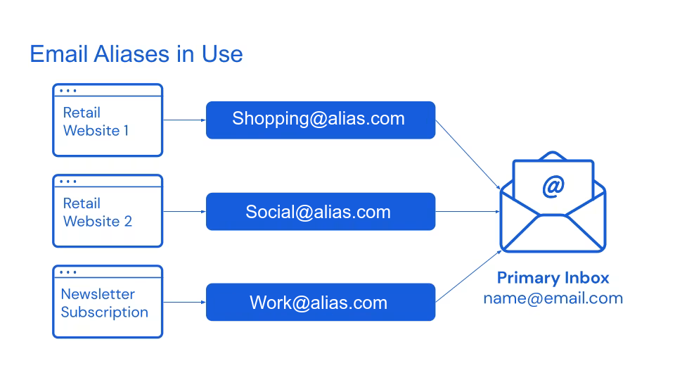

<div class="intro" align="center">

<picture>
  <source media="(prefers-color-scheme: light)" srcset="./public/logo/logo_dark.svg">
  <source media="(prefers-color-scheme: dark)" srcset="./public/logo/logo_light.svg">
  
</picture>

# Email Aliasing Comparison

[](https://github.com/fynks/email-aliasing-comparison)
[](https://github.com/fynks/email-aliasing-comparison/commits)
[](https://opensource.org/licenses/MIT)

Compare 10+ email alias services by features, pricing, security, and privacy

<div class="quick-nav">
 
[Free Plans](#free-plans-detailed-comparison) • 
[Paid Plans](#paid-plans-detailed-comparison) • 
[Security & Privacy](#privacy-and-security-analysis) • 
[Best Practices](#best-practices)

</div>
</div>

### Table of Contents

<details><summary>👉 Click to expand contents</summary>

### Getting Started
- [What is Email Aliasing?](#what-is-email-aliasing)
- [How it Works](#how-email-aliasing-works)
- [Types](#types-of-email-aliasing)
- [Provider Selector](#provider-selector)
  - [Top 3 Recommendations](#top-3-recommendations)

### Provider Comparisons  
- [Quick Reference Table](#quick-reference-table)
- [Free Plans Comparison](#free-plans-detailed-comparison)
- [Paid Plans Comparison](#paid-plans-detailed-comparison)
- [Addy.io vs SimpleLogin](#addyio-vs-simplelogin)

### Privacy & Security
- [Data Collection & Retention](#data-collection-and-retention)
- [Legal & Compliance](#legal-and-compliance)
- [Cancellation Policies](#cancellation--downgrade-behavior)

### Best Practices & Support
- [Naming Conventions](#alias-naming-conventions)
- [Organization Tips](#organization-strategies)
- [Common Mistakes](#mistakes-to-avoid)

### Reference & Help
- [Feature Glossary](#feature-glossary)
- [Troubleshooting](#troubleshooting-guide)
- [FAQ](#frequently-asked-questions)
- [Resources](#additional-resources)

</details>

## What is Email Aliasing?

Email aliasing lets you create alternate addresses that forward to your real inbox, so you can use unique addresses without exposing your primary email.

Example:
- Real inbox: john.doe@gmail.com
- Aliases: shopping@provider.com, news@provider.com
- Both forward to Gmail; many services also support replying from the alias

## Key Benefits

- **Privacy**: Hide your real email to reduce breach exposure
- **Spam control**: Disable compromised aliases instantly
- **Organization**: Sort by alias/source
- **Tracking**: Identify who leaked or sold your data
- **Security**: Use unique addresses per service

## How Email Aliasing Works

Think of it like a P.O. Box for your email: you hand out a forwarding address instead of your real one.



## Types of Email Aliasing

#### Built‑in aliases:
  - Gmail “+” addressing (yourname+tag@gmail.com)
  - Outlook additional addresses/aliases
  - Pros: free and instant • Cons: limited management, easier to guess/strip
#### Dedicated services:
  - Full alias lifecycle management, custom domains, reply support, encryption, rules, APIs, dashboards

---

## Provider Selector

Pick the fastest path based on your priorities:

| Your Need | Best Choice | Price | Why |
|---|---:|---:|---|
| **Just starting** | DuckDuckGo Email Protection | Free | Zero setup, great tracker removal |
| **Budget conscious** | Addy.io Lite | $1/mo | Strong feature/price ratio |
| **Maximum privacy** | SimpleLogin (by Proton) | $4/mo | Swiss jurisdiction, strong security, apps |
| **Apple ecosystem** | Hide My Email (iCloud+) | from $0.99/mo | System‑level integration, easy replies |
| **Developers/self‑hosting** | Forward Email | from $3/mo | Open‑source, own domain, flexible |

::: info **Notes**:
> - Prices shown are starting paid tiers where applicable; some providers offer free plans.
> - iCloud+ pricing varies by storage tier and region.
:::

[(↑ Back to top)](#table-of-contents)

---

## Top 3 Recommendations

| Best for Beginners | Best Value | Most Secure (mainstream) |
|---|---|---|
| [DuckDuckGo Email](https://duckduckgo.com/email) | [Addy.io](https://addy.io) | [SimpleLogin](https://simplelogin.io) |
| Price: Free | Price: $1/mo | Price: $4/mo |
| Aliases: Unlimited @duck.com | Aliases: Unlimited standard + shared domain limits | Aliases: Unlimited |
| Setup: Zero config | Domains: 1 custom on Lite | Jurisdiction: Switzerland (Proton) |
| ✅ Easy onboarding | ✅ GPG/OpenPGP, API | ✅ PGP, WebAuthn, Proton integration |
| ✅ Tracker removal | ✅ Rules, webhooks (higher tiers) | ✅ Mature apps and extensions |
| ❌ @duck.com only | ❌ Solo developer | ❌ Higher cost |

[(↑ Back to top)](#table-of-contents)

---

# Provider Comparisons

### Quick Reference Table
| Provider | Free Tier | Starting Pricing | Reply Support | Open Source | Encryption in transit |
| :--- | :--- | ---: | :---: | :---: | :---: |
| Addy.io (🇳🇱) | Yes | $1/mo | Paid | ✅ server code not fully OSS | TLS |
| SimpleLogin (🇨🇭, Proton) | Yes (10 aliases) | $4/mo | Free &amp; Paid | ✅ | TLS |
| Forward Email (🇺🇸) | Yes (own domain) | $3/mo | Yes (see docs) | ✅ | TLS |
| DuckDuckGo Email (🇺🇸) | Yes | ❌ | Yes | Partial | TLS |
| Firefox Relay (🇺🇸) | Yes (5 aliases) | ~ $0.99–$1.99/mo | Premium | Partial | TLS |
| AdGuard Mail (🇨🇾) | Yes (limited) | $2.99/mo | Premium | Partial | TLS |
| 33Mail (🇬🇧) | Yes | $1/mo | Premium | ❌ | TLS |
| IronVest (🇺🇸) | No free email‑only | $39/yr | Yes | ❌ | TLS |
| Erine.email (🇫🇷) | Yes | Free | Yes | ✅ | TLS |
| Apple Hide My Email (🇺🇸) | Requires iCloud+ | from $0.99/mo | Yes | ❌ | TLS |

[(↑ Back to top)](#table-of-contents)

## Free Plans Detailed Comparison

| Provider | Free Aliases | Reply Support | Custom Domains | Monthly Limits | Standout Features | Best For |
|---|---|:---:|:---:|---:|---|---|
| Addy.io | Unlimited standard + limited shared domain | ❌ | ❌ | ~10 MB bandwidth | GPG/OpenPGP, API (paid) | Power users trial |
| SimpleLogin | 10 | ✅ | ❌ | Fair use | PGP, mobile apps, browser add‑ons | Beginners |
| DuckDuckGo | Unlimited @duck.com | ✅ | ❌ | Fair use | Tracker removal, autofill | Quick start |
| Firefox Relay | 5 | ❌ | ❌ | Fair use | Tracker removal, Firefox integration | Mozilla users |
| AdGuard Mail | ~10 | ❌ | ❌ | ~2,000 emails | Temporary aliases, ecosystem | Light usage |
| 33Mail | Unlimited | ❌ | ❌ | ~10 MB | Simple & reliable | Basic forwarding |
| Erine.email | Unlimited | ✅ | ❌ | Fair use | Open‑source, EU‑hosted | Privacy advocates |
| Forward Email | Unlimited* | ✅ | ✅ (own domain) | Provider SMTP limits | Open‑source, self‑host option | Developers |
| Apple Hide My Email | N/A (iCloud+ required) | ✅ | Separate “Custom Email Domain” in iCloud Mail | Apple policy | Seamless Apple integration | Apple users |

::: info **Note:**
> *Own domain required for Forward Email free.
:::

[(↑ Back to top)](#table-of-contents)

## Paid Plans Detailed Comparison

| Provider & Plan | Price | Aliases | Reply | Domains | Key Features | Target |
|---|---:|---:|:---:|---:|---|---|
| Addy.io Lite | $1/mo | Unlimited + 50 shared | ✅ | 1 | GPG/PGP, API, basic rules | Individual |
| Addy.io Pro | $3/mo (yr) / $4/mo | Unlimited | ✅ | 20 | Analytics, rules, bulk ops, webhooks | Power users |
| SimpleLogin Premium | $4/mo | Unlimited | ✅ | Unlimited | PGP, Proton integration, directory patterns | Individuals/Teams |
| AdGuard Mail Premium | $2.99/mo | ~1,000 | ✅ | 1 | Anonymous replies, premium domains | Corporate/Power users |
| 33Mail Premium | $1/mo | Unlimited | ✅ (20/day) | 5 | Simple interface, longevity | Small business |
| 33Mail Pro | $5/mo | Unlimited | ✅ (up to 1000/day) | Unlimited | Higher volume | Business |
| IronVest Premium | $39/yr | ~50 | ✅ | ❌ | Virtual cards, phone masking | All‑in‑one privacy |
| Forward Email Enhanced | $3/mo | Unlimited | ✅ | Unlimited | 100% open‑source stack, webhooks | Developers |
| Apple iCloud+ 50GB | from $0.99/mo | Up to 1,000 | ✅ | ✅ (iCloud Mail custom domains) | System‑level integration | Apple users |

::: info **Notes:**
> - Regional pricing varies.
> - “Unlimited” often means “no fixed hard cap” but subject to fair use/abuse limits.
:::

[(↑ Back to top)](#table-of-contents)

---

# Privacy and Security Analysis

## Data Collection and Retention

Always prefer the provider’s current privacy policy; retention practices can change.

| Provider | Email Content Storage | IP Logging | Analytics | Account Data |
|---|---|---|---|---|
| Addy.io | Doesn’t persist delivered content; undelivered may queue | Short‑term for abuse/fraud | Self‑hosted analytics | Email; optional recipients (encrypted at rest) |
| SimpleLogin | Stores only what’s needed for delivery/queue; logs limited | Short‑term for abuse/fraud | Plausible (privacy‑focused) | Email, billing via processor |
| Forward Email | Delivery/queue only; self‑host options | Configurable/self‑host | None by default | Minimal (domain configs, DNS) |
| DuckDuckGo Email | Strips trackers; minimal logs | Minimization approach | Anonymous/aggregate | Email address only |
| Firefox Relay | Delivery only; Mozilla policies apply | Mozilla policies | Mozilla telemetry (privacy‑respecting) | Mozilla account data |
| AdGuard Mail | Delivery only | Anti‑abuse logs | Internal | Email and account |
| 33Mail | Delivery only | Standard logs | Unknown | Basic account |
| IronVest | Delivery only | Standard logs | Basic | Account & payment |
| Apple Hide My Email | Delivery only | Apple policy | Apple analytics | iCloud account data |

::: tip **Tip:**
- For true content secrecy, use end‑to‑end encryption (PGP/GPG) with contacts. Aliasing alone does not hide content from providers.
:::

[(↑ Back to top)](#table-of-contents)


## Cancellation / Downgrade Behavior

Knowing what breaks on downgrade helps you avoid lock‑in.

| Provider | Keeps Working | Disabled | Deleted | Risk |
|---|---|---|---|---|
| SimpleLogin | Existing aliases/domains; receive/reply within free limits | Creating new aliases beyond free | Nothing permanent | Minimal |
| Forward Email | Existing forwarding | Premium SMTP/API, priority support | Some premium configs | Low |
| AdGuard Mail | Free features, base alias quota | Premium domains/features | Premium‑only aliases | Low |
| 33Mail | Basic forwarding | Custom domains, higher reply limits | Custom domain configs | Moderate |
| Firefox Relay | First 5 aliases | Extra aliases, custom domains (if offered) | Aliases beyond free limit | Moderate |
| Addy.io | Standard aliases; 1 recipient; basic forwarding | Multiple recipients, usernames, custom/shared domains, reply | Extra recipients, premium domain aliases | Moderate |

::: tip **Tip:**
Best practice: Export alias → service mappings before you upgrade and before any downgrade.
:::

[(↑ Back to top)](#table-of-contents)

---


# Legal and Compliance

Jurisdiction can affect data access rules, retention, and gag orders. EU/CH typically offer stronger privacy protections.

| Provider | Jurisdiction | GDPR | Retention (high‑level) | Govt Requests |
|---|---|:---:|---|---|
| SimpleLogin | 🇨🇭 Switzerland (Proton) | ✅ | Minimal; logs time‑limited | Requires Swiss/EU legal process |
| Addy.io | 🇳🇱 Netherlands (EU) | ✅ | Minimal; deletion upon request | EU legal process |
| Erine.email | 🇫🇷 France (EU) | ✅ | Minimal collection | EU legal process |
| AdGuard Mail | 🇨🇾 Cyprus (EU) | ✅ | Standard EU retention | EU legal process |
| 33Mail | 🇬🇧 United Kingdom | ✅ (UK GDPR) | Standard | UK legal process |
| Forward Email | 🇺🇸 United States | ✅ (as applicable) | Configurable/self‑host | US law; self‑host option |
| DuckDuckGo | 🇺🇸 United States | ✅ (as applicable) | Minimal collection | US law; transparency statements |
| Firefox Relay | 🇺🇸 United States | ✅ (as applicable) | Mozilla policies | US law; transparency reports |
| Apple Hide My Email | 🇺🇸 United States | ✅ (as applicable) | Apple policies | US law; well‑documented process |

Practical picks:
- Maximum privacy: 🇨🇭 Switzerland (SimpleLogin/Proton)
- Strong privacy + features: 🇪🇺 EU providers (Addy.io 🇳🇱, Erine.email 🇫🇷)
- Acceptable with trade‑offs: 🇺🇸 US providers (DuckDuckGo, Forward Email, Apple), depending on threat model

[(↑ Back to top)](#table-of-contents)


---

## Addy.io vs SimpleLogin

| Criteria                 | Addy.io                         | SimpleLogin                   | Winner      |
| ------------------------ | ------------------------------- | ----------------------------- | ----------- |
| **Best for Beginners**   | Moderate setup complexity       | Simple setup and interface    | SimpleLogin |
| **Best for Power Users** | Advanced features, better value | Core features focus           | Addy.io     |
| **Best Value**           | $1/mo for most features         | $4/mo for all features        | Addy.io     |
| **Most Reliable**        | Single developer dependency     | Enterprise infrastructure     | SimpleLogin |
| **Best Privacy**         | Netherlands jurisdiction, GPG   | Switzerland jurisdiction, PGP | Tie         |

#### Company Structure Analysis

**Addy.io: The Independent Pioneer**
- **Strengths**: Quick updates, direct communication, lower costs, innovation
- **Concerns**: Single point of failure, limited capacity, no succession plan

**SimpleLogin: The Enterprise Solution**
- **Strengths**: Team redundancy, 24/7 support, financial stability, professional operations
- **Concerns**: Corporate bureaucracy, higher costs, less experimental

#### Feature Comparison Details

**Core Features**
| Feature             | Addy.io           | SimpleLogin |
| :------------------ | :---------------- | :---------- |
| **Bulk Operations** | CSV import/export | Basic bulk  |
| **Search & Filter** | Advanced          | Basic       |
| **Bounce Handling** | Detailed logs     | Basic       |
| **Spam Detection**  | SpamAssassin      | Basic       |

**Advanced Features**
| Feature                 | Addy.io         | SimpleLogin         |
| :---------------------- | :-------------- | :------------------ |
| **Conditional Rules**   | Advanced regex  | Basic patterns      |
| **Auto-Enable/Disable** | Smart rules     | Manual only         |
| **Usage Analytics**     | Detailed charts | Basic counts        |
| **Bandwidth Tracking**  | Per-alias       | Not available       |
| **Alert System**        | Configurable    | Basic notifications |

**Security Comparison**
| Feature                | Addy.io          | SimpleLogin     |
| :--------------------- | :--------------- | :-------------- |
| **2FA Support**        | TOTP only        | TOTP + WebAuthn |
| **Password Security**  | bcrypt           | Argon2          |
| **Session Management** | Standard         | Advanced        |
| **Security Audits**    | 2023 (Securitum) | Regular audits  |

[(↑ Back to top)](#table-of-contents)

---

# Best Practices

#### Alias Naming Conventions

**Recommended Formats:**
- `service-purpose@provider.com` → `amazon-shopping@provider.com`
- `category-date@provider.com` → `newsletter-2025@provider.com` 
- `trustlevel-service@provider.com` → `trusted-banking@provider.com`

**Avoid:**
- Random strings: `abc123xyz@provider.com` ❌
- Generic names: `general@provider.com` ❌
- Same alias everywhere ❌

#### Organization Strategies

**By Category:**
- `shopping@provider.com` - All e-commerce
- `social@provider.com` - Social media platforms
- `work@provider.com` - Professional accounts  
- `newsletter@provider.com` - Subscriptions

**By Trust Level:**
- `trusted@provider.com` - Banking, important services
- `testing@provider.com` - New services you're trying
- `disposable@provider.com` - One-time signups

**By Time Period:**
- `monthly-2025-01@provider.com` - Rotate monthly
- `yearly-2025@provider.com` - Annual rotation

[(↑ Back to top)](#table-of-contents)

---

# Mistakes to Avoid

1) Using random or reused aliases  
- Wrong: abc123xyz@provider.com or general@provider.com  
- Right: amazon.shopping@provider.com (unique per service)

2) Not testing replies  
- Always send a test from your alias before important use

3) Skipping password manager updates  
- Store alias + service mapping to avoid lockouts

4) No backup plan  
- Keep original email active during transition  
- Export aliases and document where used

5) Rushing critical accounts  
- Migrate low-risk accounts first; then banking/work/2FA

[(↑ Back to top)](#table-of-contents)

---

# Reference and Support

## Feature Glossary

**Core Concepts:**
- **Alias**: An email address that forwards to your real inbox
- **Catch-All**: Automatically forwards ALL emails to a domain
- **Reply Support**: Ability to send emails FROM your alias
- **Custom Domain**: Using your own domain for aliases

**Advanced Features:**
- **Directory/Subdomain**: Create aliases on-the-fly using patterns
- **Rules Engine**: Automatic actions based on email content
- **Bandwidth Limiting**: Restrict data transfer per alias
- **Webhook Support**: Real-time notifications to your applications

**Security Terms:**
- **GPG/PGP**: End-to-end encryption standards
- **Two-Factor Authentication (2FA)**: Extra login security
- **Zero-Knowledge**: Provider can't read your data

[(↑ Back to top)](#table-of-contents)

## Troubleshooting Guide

<details><summary>Emails not forwarding</summary>
1) Check spam/junk 
2) Send a direct test to the alias
3) If custom domain: wait 24–48h for DNS propagation
4) Check your email client filters/rules 
</details>

<details><summary>Can't reply from alias</summary>
1) Confirm plan supports replies  
2) Configure SMTP/app settings from provider docs  
3) Verify Reply-To in provider dashboard
</details>

<details><summary>Slow delivery</summary>
- Normal: 5–30s; peak: up to 2–5m; international: up to 10m  
- Check provider status page for incidents
</details>

[(↑ Back to top)](#table-of-contents)

## Frequently Asked Questions

<details><summary>Will recipients know it's an alias?</summary>
No. They see the alias as the sender unless you disclose it.
</details>

<details><summary>Can I reply from my alias?</summary>
Most paid services support replies. Free support varies (DuckDuckGo and SimpleLogin free support replies).
</details>

<details><summary>What if the provider shuts down?</summary>
Keep your main email active, document alias mappings, and maintain a migration plan (and optional backup provider).
</details>

<details><summary>Are aliases safe for banking?</summary>
Yes, but migrate critical accounts last and choose a reliable provider with support and strong security.
</details>

<details><summary>How many aliases do I need?</summary>
Typically 10–50. Start with categories (shopping, social, newsletters, work, disposable).
</details>

[(↑ Back to top)](#table-of-contents)

## Additional Resources
### Official Documentation
- [Addy.io Help Center](https://addy.io/help/)
- [SimpleLogin Documentation](https://simplelogin.io/docs/)
- [ForwardMail Documentation](https://forwardemail.net/en/docs)
- [DuckDuckGo Email Help](https://duckduckgo.com/duckduckgo-help-pages/email-protection/)
- [Firefox Relay Support](https://support.mozilla.org/en-US/products/relay)

### Privacy and Security Guides
- [Privacy Guides - Email Aliasing](https://www.privacyguides.org/en/email-aliasing/) - Independent privacy analysis
- [The New Oil - Email Aliasing Guide](https://thenewoil.org/en/guides/moderately-important/email-aliasing/) - Practical privacy education
- [Proton - What is Email Alias](https://proton.me/blog/what-is-email-alias) - Technical explanation from Proton

### Video Tutorials: 
- Y[The Ultimate Guide to Aliasing For Privacy & Security](https://www.youtube.com/watch?v=cgnsa5IMufs) by *Techlore*
- [ULTIMATE Email Privacy Guide (5 Ways to Use Aliases)](https://www.youtube.com/watch?v=buJHg7HRHPc) by *All Things Secured*
- [STOP Giving Your Real Email Address (do this instead)](https://www.youtube.com/watch?v=J7uGUD9kprs) by *All Things Secured*
- [Use an Email Alias!](https://www.youtube.com/watch?v=5HHdk_GP-Ew) by *Naomi Brockwell TV*

### Community Forums: 
  - [r/privacy](https://reddit.com/r/privacy) - General privacy discussions
  - [r/emailprivacy](https://www.reddit.com/r/emailprivacy)
  - [r/SimpleLogin](https://www.reddit.com/r/SimpleLogin)

[(↑ Back to top)](#table-of-contents)

---

## Contributing

Found an error or outdated info? Contributions keep this guide accurate.

- How we verify:
  - Use official docs/pricing pages/privacy policies
  - Include links and the date verified in PRs/issues
- Quick contributions:
  - Pricing/feature updates (with links/screenshots)
  - New provider suggestions (include free/paid, security, jurisdiction)
- Standards:
  - Accuracy first; neutral tone
  - Include dates for pricing/feature claims
  - Keep tables/sections consistent
  
> For more info please see: **[CONTRIBUTING.md](CONTRIBUTING.md)**

[(↑ Back to top)](#table-of-contents)

---

## License

This project is licensed under the **MIT License** - see the [LICENSE](LICENSE) file for details.

**What this means:**
- Use freely for personal or commercial purposes
- Modify and distribute with attribution
- Fork and create derivatives
- No warranty - information provided as-is

### Attribution Requirements:
When using substantial portions of this guide:
```
Source: Email Aliasing Comparison Guide
Author: github.com/fynks/email-aliasing-comparison  
License: MIT
```

[(↑ Back to top)](#table-of-contents)

---

## License

MIT License — see [LICENSE](LICENSE.md).

What this means:
- Free use for personal/commercial
- Modify and distribute with attribution
- No warranty; information is provided as‑is

Attribution for substantial reuse:
```
Source: Email Aliasing Comparison Guide
Author: github.com/fynks/email-aliasing-comparison
License: MIT
```

---

### Disclaimer
Always verify current pricing, limits, and policies from official provider sites before making decisions. The authors are not affiliated with any email aliasing providers.

---

<div align="center">

Made with ❤️ by [fynks](https://github.com/fynks)

If this guide helped you protect your email privacy, please **star ⭐ this repository**!

</div>